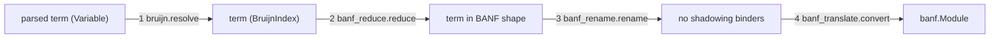

# Reduce oymomo terms to BANF shape

## Pipeline



`banf_translate.translate(term)` still runs the whole pipeline. It is split into `banf_translate.shape(term)`, which runs steps 1 to 3 and returns the term in BANF shape, and `banf_translate.convert(shaped)`, which runs step 4. Each step can also be called on its own in tests.

## Golden: the oymomo term in BANF shape
- [tests/golden_test.py](oymo/tests/golden_test.py): `compile_oymo` calls `shape` and then `convert`. It also returns the shaped term, printed with `printer.show(shaped, pretty=True)` and prefixed with the `language oymomo` header, so the file is a valid oymomo source.
- `run_golden_test` approves a third file next to `name.banf` and `name.ll`: `tests/goldens/name.shaped.oymo`. Approving `simplest.shaped.oymo` creates the first one.
- What it shows: the program after reduction and renaming, so a reader sees the inlined helpers, unfolded `fix` and `n$5` renames before they turn into BANF. Feeding it back through `translate` gives the same BANF, and a golden test checks this.

## 0. Let sugar: parse and print only

No new term. `Apply(Lambda(x, body), expr)` is already a let in BANF shape. This is only surface syntax.

**Grammar** in [grammar.py](oymo/src/oymo/oymomo/grammar.py) and [rule_names.py](oymo/src/oymo/oymomo/rule_names.py):
- Reserve `let` and `in` next to `if`, `then`, `else`, `fix`.
- New `LET` rule, same level as `LAMBDA` and `IF` (extends right as an `EXPRESSION`):
  `let NAME FORM_OPT = EXPRESSION in EXPRESSION`
- Action builds `Apply(function=Lambda(param_name, param_form, body), argument=expr)`, using the `let` token's location. Optional `: form` matches a lambda param: `let t0: i1 = prim.eq_i32 {...} in t0`.
- `let x = e in a b` is `let x = e in (a b)`. An argument needs parens: `f (let x = e in x)`.
- Nested lets parse naturally: `let x = e1 in let y = e2 in body`.

**Printer** in [printer.py](oymo/src/oymo/oymomo/printer.py):
- Both compact and pretty: if the term is `Apply` whose function is a `Lambda`, print `let x = expr in body` instead of `(x → body) expr`.
- Compact keeps written forms: `let x:unknown = e in body`. Pretty omits `: unknown` and uses `→` only inside forms, not for the let itself.
- Pretty line break when wider than `width`: `let x = expr in` then the body on the next line, indented (same idea as a lambda body). A chain of lets stays one `let` per line.
- Round-trip: `parse(show(term, pretty=True))` is the same term. Compact output also parses, including `: unknown`.

**Tests and notes:**
- [grammar_test.py](oymo/tests/oymomo/grammar_test.py): parse `let`, optional form, nesting, and that `let` / `in` are reserved. Existing compact expected strings that were `(x:… → body) expr` become `let x:… = expr in body`.
- [printer_test.py](oymo/tests/oymomo/printer_test.py): pretty `let`, width-broken chain, and that `(x → x) y` prints as `let x = y in x`.
- [notes.md](oymo/notes.md): kernel syntax list and reserved words; printer section says apply-of-lambda prints as `let`.

## 1. Resolve names: new [oymo/src/oymo/oymomo/bruijn.py](oymo/src/oymo/oymomo/bruijn.py)
- `BruijnIndex` in [terms.py](oymo/src/oymo/oymomo/terms.py) gets only a `location`, which error messages need. It does not get a name.
- `resolve(term)`: replaces each `Variable` with `BruijnIndex(index)`, where the index counts the enclosing `Lambda` binders. Binder names stay on `Lambda.param_name`.
  - An unbound name is an error. Every program is `prim -> decls -> defs -> ...`, so there are no free names.
  - Struct labels and `FieldAccess` labels are not binders, so resolution leaves them alone.
- Kernel helpers, also usable by a future evaluator:
  - `shift(term, by, cutoff)`
  - `substitute(term, index, value)`
  - `beta(lambda_, argument)`, which computes `shift(substitute(body, 0, shift(arg, 1)), -1)`
  - `unfold(fix)`, which turns `fix g` into `g (fix g)`
  - `project(field_access)`, which turns `{a = e, b = e2}.a` into `e`. A label the struct doesn't have is an error.

## 2. Reduce until BANF shape: new [oymo/src/oymo/oymomo/banf_reduce.py](oymo/src/oymo/oymomo/banf_reduce.py)
Structural: each position says which constructors it wants, and the term there is reduced until its top constructor is one of them. Then its subterm positions are visited the same way. Forms are not checked, and binder kinds are not checked; step 4 does both. So this pass needs no context stack.

**"Reduce `t` until it is X"**: if `t`'s top constructor is in X, stop. Otherwise take one step and look again:
- `(x -> body) arg`: beta.
- `fix g`: unfold to `g (fix g)`.
- `{a = e, ...}.a`: project to `e`. A label the struct doesn't have is an error.
- `f a`, where `f` is not a lambda: reduce `f` until it is a Lambda, then beta.
- `s.a`, where `s` is not a struct literal: reduce `s` until it is a Struct, then project.
- Anything else, for example a Lambda where a Struct is wanted: error, "expected X".

Two rules about what counts as a match:
- A redex `(x -> body) arg` counts as an Apply only in a block body, where it is a let.
- A projection `{...}.a` never counts as a FieldAccess.

**Positions.** Each `<name>` is a position, reduced as described above:
1. Reduce the term until it is a Lambda: `prim -> <decls>`.
2. Reduce `<decls>` until it is a Lambda: `decls -> <defs>`.
3. Reduce `<defs>` until it is a Lambda: `defs -> <body>`.
4. Reduce `<body>` until it is a Struct: `{label_i = <func>, ...}`.
5. Reduce `<func>` until it is a Lambda: `f -> <func_body>`.
6. Reduce `<func_body>` until it is a Struct: `{entry = <block>, label_i = <block>, ...}`.
7. Reduce `<block>` until it is a Lambda: `args -> <block_body>`.
8. `<block_body>` is a chain of lets ending in a terminal:
   ```
   block_body := terminal | (x -> block_body) <value>      -- a let
   terminal   := [bytes]                                    -- return a constant
               | args.label                                 -- return a param
               | $i, where i < k                            -- return a let variable
               | blocks.label <op_arg>                      -- jump
               | if <atom> then <jump> else <jump>          -- branch
   ```
   - `k` is the number of lets between this body and the block's `args` binder, so `args` is `$k` at this point. `$i` is how a BruijnIndex is written, here and in the printer's compact mode. The reducer keeps only this counter. It resets to 0 at each block and adds 1 per let.
   - `$i` with `i < k` is a let of this block. `$k` is `args` itself, and `$i` with `i > k` would be `blocks`, `f`, `defs`, `decls` or `prim`. Neither is a terminal, so both get the error "expected a let or a terminal".
   - `args.label` and `blocks.label` are a FieldAccess on any BruijnIndex. Step 4 checks which binder it is.
   - Returning an op needs no special case: `(z -> z) <value>` is a let followed by the terminal `$0`.
   The instruction, repeated until a terminal is reached:
   1. If `<block_body>` matches a terminal, visit the terminal's own positions (`<value>`, `<op_arg>`, `<atom>`, `<jump>`). Done.
   2. Else, if it is a let `(x -> rest) <value>`, reduce `<value>` until it is an op: an Apply, Struct or FieldAccess (step 9).
      - If it becomes one, keep the let and continue with `rest` as the `<block_body>`.
      - If it can't, because it ends as a Lambda, BruijnIndex, ByteArray or If, beta-reduce the whole let and continue with the result. That covers copy propagation and inlining a helper.
   3. Else take one step (beta, `fix`, projection, or a step on the head) and go back to 1. If no step is possible, the error is "expected a let or a terminal".
9. `<value>`, a let's op:
   - Apply `<callee> <op_arg>`: reduce `<callee>` until it is a FieldAccess, and its base until it is a BruijnIndex, as in `prim.op`, `defs.f` or `decls.f`. Then reduce `<op_arg>` until it is a Struct `{label_i = <atom>, ...}` or a BruijnIndex (forwarding the block's `args`).
   - Struct `{label_i = <atom>, ...}`: a `MakeStruct`.
   - FieldAccess `<s>.label`: reduce `<s>` until it is a BruijnIndex. This is a `GetField`, a `GetData` (`decls.x`), or `args.n`.
10. `<jump>`, an `if` arm: reduce until it is the jump terminal `blocks.label <op_arg>`, then visit `<op_arg>`.
11. `<atom>`: reduce until it is a ByteArray, a BruijnIndex `$i` with `i < k` (a let of this block), or a FieldAccess whose base reduces to a BruijnIndex (`args.n`). An atom can't be `args` itself, because BANF has no struct-valued param.

Two more rules:
- A fuel counter, about 10,000 steps per program, stops reductions that never terminate (for example omega, or unbounded `fix`). When it runs out, the error is "did not reach BANF shape" with the location.
- A position that already has a wanted constructor is never reduced further. For example, a let-bound struct `(s -> s.a) ({a = x})` stays a `MakeStruct` followed by a `GetField`.

Step 2 only fixes constructors. Step 4 checks the rest, for example that a let's `prim.op` really is on the prim binder, that `blocks.label` exists, and that forms are known.

## 3. Rename shadowing binders: new [oymo/src/oymo/oymomo/banf_rename.py](oymo/src/oymo/oymomo/banf_rename.py)
- Walk the binders, tracking the visible names: every enclosing binder name, plus the current block's param labels.
- A `Lambda` whose `param_name` is already visible becomes `f'{name}${level}'`, where `level` is its de Bruijn level (its depth from the program root). Example: `args:{n: i32} -> (n -> ...)`, where the let sits at level 5, renames the let to `n$5`.
- Struct labels are never renamed. Names only need to avoid shadowing, not be globally unique. `$` can't appear in a plain identifier, so a renamed name never clashes with a user's name. The oymomo pretty printer and BANF print it quoted (`"n$5"`), and so does LLVM (`%"n$5"`). A BruijnIndex prints as `$i` in compact mode, a bare number after the sigil. A renamed binder always has a name before the `$` (`n$5`), so the two can't be confused.

## 4. Convert to BANF: rewrite [oymo/src/oymo/oymomo/banf_translate.py](oymo/src/oymo/oymomo/banf_translate.py)
- Same structure as today: `_unwrap`, `_imports`, `_function_header`, `_Translator` (`atom`, `op`, `jump`, `body`), return-form inference, and written-form checks.
- The difference is that variables are `BruijnIndex` values resolved through the context stack. A let reference becomes `banf.Var(binder_name)`, and `args.n` becomes `banf.Var('n')`.
- Errors that become unnecessary are removed:
  - "Let repeats param label, earlier let, or binder name": these are renamed now.
  - "prim, decls and defs must have different names", and "block binder repeats an outer binder name": indices make these unambiguous.
  - "fix is not supported".
  - "only block and let lambdas are supported": such terms are reduced now.
- Errors that remain are for shapes that can't be reduced, for example:
  - an op in tail position that isn't bound by a let;
  - an `if` whose arms aren't jumps;
  - a binder such as `prim` or `args` used as a value;
  - unknown prims, defs, imports or blocks.

## Printer, notes, tests
- [printer.py](oymo/src/oymo/oymomo/printer.py):
  - The pretty printer prints a `BruijnIndex` using the name of its binder, tracked on a stack, so resolved and renamed terms still read like source.
  - Compact mode prints a BruijnIndex as `$i`. Today it prints `#i`, so this changes, along with the `#0` in the notes' printer section.
- [notes.md](oymo/notes.md):
  - Replace "a shape checker, not a normalizer" and "Let names are never renamed" with the four steps, the fix and fuel rule, and the `$level` renaming.
  - Remove "No surface syntax for BruijnIndex" as an exception in the printer section.
- Tests:
  - `bruijn_test.py`: resolve, shift, substitute and beta, including the classic capture case `(x -> y -> x) y`.
  - `banf_reduce_test.py`:
    - helper inlining, for example `(id -> ...) (x -> x)` with `id args.n` as an op argument;
    - an atom let substituted;
    - a def produced by an application;
    - `fix` unfolding;
    - projection: `{a = args.n}.a` as an op argument, a nested `{p = {a = e}}.p.a`, projection after beta (`(mk -> (mk args).n) (a -> {n = a.n})`), and a missing label as an error;
    - running out of fuel;
    - one test per position: a term that becomes a Lambda, Struct, Apply and so on after reduction;
    - a let whose op has a redex operand stays a let, and only the operand is reduced;
    - a let whose value is an atom is beta-reduced as a whole;
    - every terminal: `[bytes]`, `args.n`, a let variable (`$i`, `i < k`), a jump and an `if`. `args` itself (`$k`) and a variable above it (`$i`, `i > k`, such as `prim`) are rejected;
    - a let-bound struct stays a let;
    - forms are ignored: a lambda written without a form still reduces;
    - the "expected X" error when no step is possible, for example a lambda where a block struct is wanted.
  - `banf_rename_test.py`: a let shadowing a param label, a let shadowing an earlier let, and nested levels.
  - `banf_translate_test.py`: update the tests whose rejections now become renames or reductions. Two need care:
    - `test_imports` ends in `(w -> t0) (c.w)`, which returns an earlier let's variable (`$1`, below `args`). It stays valid as it is.
    - `(t -> t) (args.n)` was rejected with "A let's value must be an op". It now beta-reduces to the `args.n` terminal and is accepted.
    - Beyond those, the expected BANF output for the golden programs stays the same.
  - Golden: `simplest.shaped.oymo` is approved, and parsing it and translating again gives the same `simplest.banf`.
