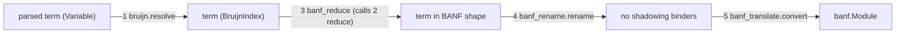

# Reduce oymomo terms to BANF shape

## Pipeline



`banf_translate.translate(term)` still runs the whole pipeline. It is split into `banf_translate.shape(term)`, which runs steps 1 to 4 and returns the term in BANF shape, and `banf_translate.convert(shaped)`, which runs step 5. Step 2, `reduce`, is not a pass of its own: it is one function, and step 3 calls it whenever a term doesn't have BANF's shape yet. Each step can also be called on its own in tests.

## Golden: the oymomo term in BANF shape
- [tests/golden_test.py](oymo/tests/golden_test.py): `compile_oymo` calls `shape` and then `convert`. It also returns the shaped term, printed with `printer.show(shaped, pretty=True)` and prefixed with the `language oymomo` header, so the file is a valid oymomo source.
- `run_golden_test` approves a third file next to `name.banf` and `name.ll`: `tests/goldens/name.shaped.oymo`. Approving `simplest.shaped.oymo` creates the first one.
- What it shows: the program after reduction and renaming, so a reader sees the inlined helpers, unfolded `fix` and renamed binders such as `n1` before they turn into BANF. Feeding it back through `translate` gives the same BANF, and a golden test checks this.

## 0. Let sugar: parse and print only

No new term. `Apply(Lambda(x, body), expr)` is already a let in BANF shape. This is only surface syntax.

**Grammar** in [grammar.py](oymo/src/oymo/oymomo/grammar.py) and [rule_names.py](oymo/src/oymo/oymomo/rule_names.py):
- Reserve `let` and `in` next to `if`, `then`, `else`, `fix`.
- New `LET` rule, same level as `LAMBDA` and `IF` (extends right as an `EXPRESSION`):
  `let NAME FORM_OPT = EXPRESSION in EXPRESSION`
- Action builds `Apply(function=Lambda(param_name, param_form, body), argument=expr)`, using the `let` token's location. Optional `: form` matches a lambda param: `let t0: i1 = prim.eq_i32 {...} in t0`.
- `let x = e in a b` is `let x = e in (a b)`. An argument needs parens: `f (let x = e in x)`.
- Nested lets parse naturally: `let x = e1 in let y = e2 in body`.

**Printer** in [printer.py](oymo/src/oymo/oymomo/printer.py):
- Both compact and pretty: if the term is `Apply` whose function is a `Lambda`, print `let x = expr in body` instead of `(x → body) expr`.
- Compact keeps written forms: `let x:unknown = e in body`. Pretty omits `: unknown` and uses `→` only inside forms, not for the let itself.
- Pretty line break when wider than `width`: `let x = expr in` then the body on the next line, indented (same idea as a lambda body). A chain of lets stays one `let` per line.
- Round-trip: `parse(show(term, pretty=True))` is the same term. Compact output also parses, including `: unknown`.

**Tests and notes:**
- [grammar_test.py](oymo/tests/oymomo/grammar_test.py): parse `let`, optional form, nesting, and that `let` / `in` are reserved. Existing compact expected strings that were `(x:… → body) expr` become `let x:… = expr in body`.
- [printer_test.py](oymo/tests/oymomo/printer_test.py): pretty `let`, width-broken chain, and that `(x → x) y` prints as `let x = y in x`.
- [notes.md](oymo/notes.md): kernel syntax list and reserved words; printer section says apply-of-lambda prints as `let`.

## 1. Resolve names: new [oymo/src/oymo/oymomo/bruijn.py](oymo/src/oymo/oymomo/bruijn.py)
- `BruijnIndex` in [terms.py](oymo/src/oymo/oymomo/terms.py) gets only a `location`, which error messages need. It does not get a name.
- `resolve(term)`: replaces each `Variable` with `BruijnIndex(index)`, where the index counts the enclosing `Lambda` binders. Binder names stay on `Lambda.param_name`.
  - An unbound name is an error. Every program is `prim -> decls -> defs -> ...`, so there are no free names.
  - Struct labels and `FieldAccess` labels are not binders, so resolution leaves them alone.
- Kernel helpers, used by `reduce` in step 2:
  - `shift(term, by, cutoff)`
  - `substitute(term, index, value)`
  - `beta(lambda_, argument)`, which computes `shift(substitute(body, 0, shift(arg, 1)), -1)`
  - `unfold(fix)`, which turns `fix g` into `g (fix g)`
  - `project(field_access)`, which turns `{a = e, b = e2}.a` into `e`. `reduce` calls it only when the struct has the label.

## 2. Reduce one step at the root: `reduce` in [oymo/src/oymo/oymomo/bruijn.py](oymo/src/oymo/oymomo/bruijn.py)
`reduce(term)` takes one resolved term. If the term itself is a redex, it reduces it once and returns the result. If not, it returns `term` itself, the same object, so a caller checks `reduce(t) is t`, as with `Term.unfold()` in [syntax.py](oymo/src/oymo/core/syntax.py). It never raises. Step 3 calls it whenever a term doesn't have the shape it wants yet, and a future evaluator can call it too.

**All rules.** `t ~> t'` means `reduce(t)` returns `t'`.
```
(x -> body) arg         ~>  beta(x -> body, arg)   -- beta: bruijn.beta
fix g                   ~>  g (fix g)              -- unfold: bruijn.unfold
{..., a = e, ...}.a     ~>  e                      -- project: bruijn.project
if [01] then a else b   ~>  a                      -- if true
if [00] then a else b   ~>  b                      -- if false
anything else           ~>  itself
```
- Only the root. `reduce` never looks inside the term: arguments, lambda bodies, struct fields and `if` arms stay as they are. So does the head of a term whose root isn't a redex yet: `(fix g) a`, `{p = {a = e}}.p.a` and `if ((x -> x) [01]) then a else b` come back as they are. Step 3 reduces heads.
- At most one rule applies to any term, so the order of the rules doesn't matter.
- "Anything else" also covers every Lambda, Struct, ByteArray and BruijnIndex; a call such as `prim.add_i32 {...}` or `$3 x`; a field access such as `args.n`; a projection of a label the struct doesn't have; and an `if` whose condition isn't the one byte `01` or `00`, the two i1 values. The condition's form isn't checked.
- Prims are not run: `prim` is only a binder here.
- One call applies at most one rule and doesn't recurse, so it always finishes. Loops come from calling it again and again, so the fuel counter is in step 3.

## 3. Reduce until BANF shape: new [oymo/src/oymo/oymomo/banf_reduce.py](oymo/src/oymo/oymomo/banf_reduce.py)
Structural matching: each position says which constructors it wants, and the term there is reduced with `reduce` (step 2) until it has one of them. Then its subterm positions are visited the same way. Forms are not checked, and binder kinds are not checked except for `args` (see `k` below); step 5 does both. So this pass needs no context stack.

**Heads.** `reduce` only works on the root, but some roots become a redex only after their head is reduced. In `(fix g) a`, `fix g` must first unfold and beta-reduce to a lambda, and only then is the whole term a beta redex. The head of an Apply is its function, of a FieldAccess its struct, and of an If its condition. A Lambda, Struct, ByteArray or BruijnIndex has no head. Step 3 has two small helpers on top of `reduce`:
```
step(t) = reduce(t)        if reduce(t) is not t                        -- a step at the root
        = t with head h'   if t has a head h, and h' = whnf(h) is not h   -- else reduce the head
        = t                otherwise

whnf(t) = whnf(step(t))    if step(t) is not t
        = t                otherwise
```
`whnf` stops when neither the root nor the head can take a step: at every Lambda, Struct, ByteArray and BruijnIndex, and at stuck terms such as `prim.add_i32 {...}`, `args.n`, `blocks.done {...}` or `if t0 then a else b`.

**"Reduce `t` until it is X"**: replace `t` with `whnf(t)`, then look at its top constructor. Every X below is a shape where `whnf` stops, so this reduces exactly as far as needed. Looking first and reducing only on a mismatch would be wrong: `{f = x -> ...}.f args.n` is already an Apply, but its callee must be reduced before it is a call such as `prim.op {...}`.

**If it doesn't become X**, for example a Lambda where a Struct is wanted, step 3 leaves it as it is and doesn't visit its parts. Step 5 then reports the error with today's message, for example "Both branches of an if must be jumps". So step 3 has no errors of its own except running out of fuel.

**Positions.** Each `<name>` is a position, reduced as described above:
1. Reduce the term until it is a Lambda: `prim -> <decls>`.
2. Reduce `<decls>` until it is a Lambda: `decls -> <defs>`.
3. Reduce `<defs>` until it is a Lambda: `defs -> <body>`.
4. Reduce `<body>` until it is a Struct: `{label_i = <func>, ...}`.
5. Reduce `<func>` until it is a Lambda: `f -> <func_body>`.
6. Reduce `<func_body>` until it is a Struct: `{entry = <block>, label_i = <block>, ...}`.
7. Reduce `<block>` until it is a Lambda: `args -> <block_body>`.
8. `<block_body>` is a chain of lets ending in a terminal. A let is a redex that must be kept, so the block body is not reduced with `whnf`:
   ```
   block_body := terminal | (x -> block_body) <value>      -- a let
   terminal   := [bytes]                                    -- return a constant
               | args.label                                 -- return a param
               | $i, where i < k                            -- return a let variable
               | blocks.label <op_arg>                      -- jump
               | if <atom> then <jump> else <jump>          -- branch
   ```
   - `k` is the number of lets between this body and the block's `args` binder, so `args` is `$k` at this point. `$i` is how a BruijnIndex is written, here and in the printer's compact mode. The reducer keeps only this counter, to tell `args.label` (`$k.label`) from other field accesses in 8.1. It resets to 0 at each block and adds 1 per let.
   - `$i` with `i < k` is a let of this block. `$k` is `args` itself, and `$i` with `i > k` would be `blocks`, `f`, `defs`, `decls` or `prim`. Neither is a terminal, so step 3 leaves them and step 5 reports them.
   - `args.label` and `blocks.label` are a FieldAccess on any BruijnIndex. Step 5 checks which binder it is.
   - Returning an op needs no special case: `(z -> z) <value>` is a let followed by the terminal `$0`.
   The instruction, repeated until it stops:
   1. If `<block_body>` is a let `(x -> rest) <value>`, replace `<value>` with `whnf(<value>)`.
      - If it is an op, keep the let, visit the op's parts (step 9), and continue with `rest` as the `<block_body>`. An op is an Apply, a Struct, or a FieldAccess other than `args.label`.
      - Otherwise it is a Lambda, BruijnIndex, ByteArray, `args.label` or If. Beta-reduce the whole let and continue with the result. That covers copy propagation and inlining a helper.
   2. Else, if `step(<block_body>)` is not `<block_body>`, continue with it. This can make a let: in `(x -> y -> rest) a b`, the head reduces and leaves the let `(y -> rest') b`.
   3. Else it should be a terminal. Visit the terminal's own positions (`<op_arg>`, `<atom>`, `<jump>`) and stop. Anything else is left for step 5.
9. `<value>`, a let's op, already reduced by 8.1:
   - Apply `<callee> <op_arg>`, as in `prim.op`, `defs.f` or `decls.f` applied to an argument. The callee is the head, so `whnf` has already reduced it. Reduce `<op_arg>` until it is a Struct `{label_i = <atom>, ...}` or a BruijnIndex (forwarding the block's `args`).
   - Struct `{label_i = <atom>, ...}`: a `MakeStruct`.
   - FieldAccess `<s>.label`: `<s>` is the head, so `whnf` has already reduced it. This is a `GetField` on an atom, such as a let or a struct param `args.p`, or a `GetData` (`decls.x`).
10. `<jump>`, an `if` arm: reduce until it is the jump terminal `blocks.label <op_arg>`, then visit `<op_arg>`.
11. `<atom>`: reduce until it is a ByteArray, a BruijnIndex `$i` with `i < k` (a let of this block), or `args.n`. `args` itself is not an atom: BANF passes a block's params one by one, not as one struct.

Two more rules:
- A fuel counter, about 10,000 steps per program, stops reductions that never terminate (for example omega, or unbounded `fix`). Each `reduce` that changes a term uses one step. When it runs out, the error is "did not reach BANF shape" with the location.
- A position that already has a wanted constructor is never reduced further, because `whnf` stops there. For example, a let-bound struct `(s -> (y -> y) (s.a)) ({a = x})` stays a `MakeStruct` followed by a `GetField`.

Step 3 only fixes constructors. Step 5 checks the rest, for example that a let's `prim.op` really is on the prim binder, that `blocks.label` exists, and that forms are known.

## 4. Rename binders: new [oymo/src/oymo/oymomo/banf_rename.py](oymo/src/oymo/oymomo/banf_rename.py)
One walk from the outside in. It renames binders only; labels, including block param labels, stay as written.
- **Structural binders get fixed names.** The walk follows positions 1, 2, 3, 5 and 7 of step 3 and renames those binders, whatever they were called:

  | Position | Binder | Fixed name |
  |---|---|---|
  | 1 | the outer lambda | `prim` |
  | 2 | the second lambda | `decls` |
  | 3 | the third lambda | `defs` |
  | 5 | each function's lambda (its blocks) | `f` |
  | 7 | each block's lambda (its args) | `a` |

  So every shaped program reads `prim -> decls -> defs -> {main = f -> {entry = a -> …}}`, with jumps written `f.label` and params `a.n`. On any path from the root these five names appear once each, so they never clash with each other. A position that step 3 left without its shape (for step 5 to report) is not structural, and its binder follows the rule below.
- **Visible names.** The walk carries the set of names visible at the current point:
  - the names already given to the enclosing binders, including the five fixed names;
  - inside a block body, that block's param labels. They become BANF `Var`s, as in `entry(n: i32)`, so a let must not reuse one.

  No other label goes in the set. Struct labels, `FieldAccess` labels, block labels and function names live in their own namespaces in oymomo and in BANF (`Jump.target`, `Call.function`, `GetData.name` are plain strings, not `Var`s). So a let `n` used as `{n = n}` keeps its name.
- **Every other binder** (lets, and any lambda step 3 left), with original name `x` and level `L` (the number of binders enclosing it, counted from the root):
  1. If `x` is not visible, keep `x`.
  2. Otherwise try `x_L`. If that is visible too, try `x__L`, then `x___L`, and so on. Use the first one that isn't visible.

  The new name joins the set for the binder's body, and leaves it on the way back up. A plain set is enough, because the names on one path are always distinct. The loop stops, because each extra `_` gives a name that wasn't tried before, and the set is finite.
- **Result:**
  - No binder hides another one on any path, and no let reuses its block's param labels. So each BANF block's params and lets have distinct names, and the pretty printer can print each `BruijnIndex` as its binder's name and parse back the same term.
  - Most programs keep every name the user wrote. The current goldens have no shadowing, so their `.banf` and `.ll` files should not change.
  - Sibling blocks can reuse a name, because BANF scopes names per block. LLVM may then add `.1` in the `.ll` file. That is accepted: only the `.ll` names change, and the code is still correct.
- **Idempotent:** after one run nothing clashes, so a second run keeps every name.
- **Cost:** one hash set, with an add on the way down and a remove on the way up. Each binder costs O(1) expected time, and a retry happens only on a clash. The whole pass is O(size of the term).
- Labels are never renamed: struct labels, `FieldAccess` labels, block labels and param labels all stay as written.
- References are indices, so a rename only changes the binder. Step 5 keeps the binder names in an array indexed by level, and resolves `$j` at depth `d` to `names[d - 1 - j]` in O(1).
- The fixed names don't reach BANF: `f.label` becomes a jump target and `a.n` becomes `banf.Var('n')`.
- Examples, with `e1`, `e2` and `e3` standing for any ops. The lets in a block start at level 5, under `prim`, `decls`, `defs`, `f` and `a`:
  ```
  let t = e1 in let t = e2 t in let t = e3 t in t
  becomes
  let t = e1 in let t_6 = e2 t in let t_7 = e3 t_6 in t_7
  ```
  A block whose lets repeat its param label twice:
  ```
  entry = args: {n: i32} →
    let n = prim.add_i32 {a = args.n, b = args.n} in
    let n = prim.mul_i32 {a = n, b = n} in
    n
  ```
  becomes
  ```
  entry = a: {n: i32} →
    let n_5 = prim.add_i32 {a = a.n, b = a.n} in
    let n_6 = prim.mul_i32 {a = n_5, b = n_5} in
    n_6
  ```
  converts to
  ```
  entry(n: i32):
    n_5 = prim.add_i32(n, n)
    n_6 = prim.mul_i32(n_5, n_5)
    return n_6
  ```
  More cases:
  - A user's own `t_6` after the renamed `t_6`: its original is `t_6`, so the first try is `t_6_7`, which is free:
    ```
    let t = e1 in let t = e2 t in let t_6 = e3 t in t_6
    becomes
    let t = e1 in let t_6 = e2 t in let t_6_7 = e3 t_6 in t_6_7
    ```
  - `x__L` only appears when `x_L` is itself visible, which needs a user's binder named `x_L` above:
    ```
    let t = e1 in let t_7 = e2 t in let t = e3 t_7 in t
    becomes
    let t = e1 in let t_7 = e2 t in let t__7 = e3 t_7 in t__7
    ```
    At level 7, `t` is visible (level 5) and `t_7` is visible (level 6), so the third let gets `t__7`.
  - A let named `a` becomes `a_5`, since `a` is the block's binder.
- Rejected:
  - one set per function, to avoid LLVM's `.1`: it renames lets that clash only with a sibling block, and LLVM names don't matter;
  - checking every label (struct, field, block, function): those are separate namespaces, and collecting them would need an extra pass;
  - renaming params: param labels are the labels of the block's form, of `a.n` and of every jump's `{n = …}`, so renaming them means rewriting labels in many places;
  - `_<level>_<original>` for every binder: unique without a set, but it renames every let, even ones that clash with nothing;
  - `name$level` (`n$5`): it needs quotes.

## 5. Convert to BANF: rewrite [oymo/src/oymo/oymomo/banf_translate.py](oymo/src/oymo/oymomo/banf_translate.py)
Step 5 takes the renamed term and trusts step 4's fixed names. It stores no binder names of its own.

**Fixed names, checked by name.** The five names are constants in one place (`PRIM`, `DECLS`, `DEFS`, `BLOCKS = 'f'`, `ARGS = 'a'` in `banf_rename.py`), and step 5 imports them. The program must be exactly:
```
prim -> decls: {...} -> defs -> {name = f -> {label = a: {...} -> body, ...}, ...}
```
- `_unwrap` matches `Lambda(param_name=PRIM, body=Lambda(param_name=DECLS, ...))` and so on, down to `Lambda(param_name=DEFS, body=Struct)`.
- `_function_header` matches `Lambda(param_name=BLOCKS, body=Struct)` and each block `Lambda(param_name=ARGS, param_form=StructForm)`.
- A binder with another name at one of these positions is an error, with today's shape messages, for example "Expected a program of the shape prim -> decls: {...} -> defs -> {...}" or "Definition 'main' must be a struct of blocks". Step 4 only gives a fixed name to a position step 3 shaped, so a wrong name means a wrong shape, and the name check doubles as the shape check.

**No binder names in the translator's state.**
- `_Program` keeps `imports` and `functions` only. The `prim`, `decls` and `defs` fields go.
- `_Block` keeps `function` and `params`, plus `lets`, the list of `banf.Let`s built so far for this block. The `blocks_binder` and `args_binder` fields and the `lets` name set go.
- `binder_error`, `bind_let` and the "Block binder repeats an outer binder name" check go. Step 4 already guarantees that names are distinct.

**References are classified by index, not by name.** Inside a block body with `k` lets so far (`k = len(block.lets)`), the binders above, from the inside out, are always:
```
$0 .. $k-1   the lets, newest first
$k           a       (the block's args)
$k+1         f       (the function's blocks)
$k+2         defs
$k+3         decls
$k+4         prim
```
So one helper, `_binder(index, k)`, returns `('let', i)`, `ARGS`, `BLOCKS`, `DEFS`, `DECLS` or `PRIM`, using only arithmetic:
- `$j` with `j < k`: an atom, `banf.Var(block.lets[k - 1 - j].name)`. The name comes from the BANF let already built, which is step 4's name.
- `$k.n` (`a.n`): `banf.Var(n)`, if `n` is a param label.
- `$k` alone (`a`) as an op argument: forwards the params, as today.
- `$(k+1).label {...}` (`f.label`): a jump.
- `$(k+2).g {...}`, `$(k+3).g {...}` / `$(k+3).x`, `$(k+4).op {...}`: `Call` to a def, `Call` to an import / `GetData`, `PrimCall`.
- Any of `a`, `f`, `defs`, `decls`, `prim` used as a plain value is an error: "'prim' cannot be used as a value". The message uses the constant's name.

**What stays as today:** `_imports`, return-form inference, written-form checks, `banf.verify`, and the messages for shapes step 3 can't fix:
- an op in tail position that isn't bound by a let;
- an `if` whose arms aren't jumps;
- a label that a struct literal doesn't have, as in `{a = x}.b`;
- unknown prims, defs, imports or blocks.

**Errors that go away:**
- "Let repeats param label, earlier let, or binder name": step 4 renames these.
- "prim, decls and defs must have different names", "Block binder repeats an outer binder name": step 4 gives them fixed, distinct names.
- "fix is not supported", "Only block and let lambdas are supported": step 3 reduces these.

## Printer, notes, tests
- [printer.py](oymo/src/oymo/oymomo/printer.py):
  - The pretty printer prints a `BruijnIndex` using the name of its binder, tracked on a stack, so resolved and renamed terms still read like source.
  - Compact mode prints a BruijnIndex as `$i`. Today it prints `#i`, so this changes, along with the `#0` in the notes' printer section.
- [notes.md](oymo/notes.md):
  - Replace "a shape checker, not a normalizer" and "Let names are never renamed" with the four passes, the rules of `reduce`, how step 3 uses it (heads, lets, terms left for step 5), the fix and fuel rule, and the renaming rule (fixed structural names; other binders keep their name unless it is visible (enclosing binders, the block's param labels), else `x_L`, `x__L`, …; labels never renamed).
  - Remove "No surface syntax for BruijnIndex" as an exception in the printer section.
- Tests:
  - `bruijn_test.py`: resolve, shift, substitute and beta, including the classic capture case `(x -> y -> x) y`. And `reduce`:
    - each rule as one step: `(x -> x) y` gives `y`, `fix g` gives `g (fix g)`, `{a = e}.a` gives `e`, and `if [01]` and `if [00]` pick their arm;
    - only one step, and arguments stay unreduced: `(x -> x) ((y -> y) z)` gives `(y -> y) z`, and `(x -> y) omega` gives `y`;
    - the term itself, checked with `is`, when the root isn't a redex: a lambda, a struct, a byte array, a BruijnIndex, `prim.add_i32 {...}`, `args.n`, `if t0 then a else b`, `if [02] then a else b` and the missing label `{a = e}.b`;
    - the term itself when only its head could take a step: `{p = {a = e}}.p.a`, `((x -> x) (y -> y)) z`, `(fix g) a` and `if ((x -> x) [01]) then a else b`;
    - nothing inside is reduced: `x -> (y -> y) x` gives the term itself.
  - `banf_reduce_test.py`:
    - `step` and `whnf` on the head examples above: `whnf` of `{p = {a = e}}.p.a` gives `e`, and of `(fix (self -> n -> n)) a` gives `a`;
    - helper inlining, for example `(id -> ...) (x -> x)` with `id args.n` as an op argument;
    - an atom let substituted, including `(t -> t) (args.n)`, which becomes the terminal `args.n`;
    - a def produced by an application;
    - `fix` unfolding, applied as in `(fix g) args.n`;
    - heads: `((a -> {n = a.n}) args).n` in tail position becomes `args.n`; `{f = x -> ...}.f args.n` as a let's value is inlined; and in `(x -> y -> rest) a b` the head reduces, and `(y -> rest') b` is then a let;
    - projection: `{a = args.n}.a` as an op argument, a nested `{p = {a = e}}.p.a`, and projection after beta (`(mk -> (mk args).n) (a -> {n = a.n})`);
    - running out of fuel;
    - one test per position: a term that becomes a Lambda, Struct, Apply and so on after reduction;
    - a let whose op has a redex operand stays a let, and only the operand is reduced;
    - a let whose value is an atom is beta-reduced as a whole;
    - every terminal: `[bytes]`, `args.n`, a let variable (`$i`, `i < k`), a jump and an `if`;
    - a let-bound struct stays a let, and so does a `GetField` on a struct param, `args.p.x`;
    - forms are ignored: a lambda written without a form still reduces;
    - a term that can't reach its shape is returned as it is, for step 5 to report: a lambda where a block struct is wanted, the missing label `{a = x}.b`, and `args` itself (`$k`) or a variable above it (`$i`, `i > k`, such as `prim`) in tail position;
    - a term already in BANF shape comes back unchanged.
  - `banf_rename_test.py`:
    - structural binders: `p -> d -> prim -> {main = blocks -> {entry = args -> …}}` becomes `prim -> decls -> defs -> {main = f -> {entry = a -> …}}`;
    - a let that clashes with nothing keeps its name, and so does a let named like a struct label (`{n = n}`) or a block label;
    - the chain `t, t, t` becomes `t, t_6, t_7`, and two lets that repeat a param label `n` become `n_5, n_6`;
    - a let named after a fixed name (`a`, `f`) becomes `a_5`, `f_5`;
    - sibling blocks can both keep `t`;
    - a user's `t_6` after a renamed `t_6` becomes `t_6_7`, and `t, t_7, t` becomes `t, t_7, t__7`;
    - param labels are never renamed;
    - a position step 3 left without its shape gets the keep-or-suffix rule, not a fixed name;
    - a second run gives the same term.
  - `banf_translate_test.py`: update the tests whose rejections now become renames or reductions. Two need care:
    - `test_imports` ends in `(w -> t0) (c.w)`, which returns an earlier let's variable (`$3`, with `k` = 4). It stays valid as it is.
    - `(t -> t) (args.n)` was rejected with "A let's value must be an op". It now beta-reduces to the `args.n` terminal and is accepted.
    - Beyond those, the error messages for shapes that can't be reduced stay the same, because step 3 leaves those terms for step 5. Expected BANF output changes only where a let reused a visible name, which today is an error. So the golden `.banf` and `.ll` files stay the same.
  - Golden: `simplest.shaped.oymo` is approved, and parsing it and translating again gives the same `simplest.banf`.
