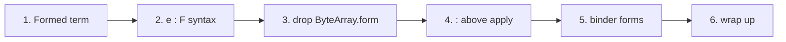

# Plan: no enforced parentheses, and `expression : expression`

Status: **in progress**. Steps 1 to 3 are done. Open questions below.

## Steps

One commit each. Details are in [Implementation steps](#implementation-steps).

- [x] 1. Add the `Formed` term, with no syntax yet (`oymomo: add Formed term`)
- [x] 2. Parse `e : F` as `Formed`, not breaking (`oymomo: parse e : F as Formed`)
- [x] 3. Remove `ByteArray.form`, breaking (`oymomo: a byte array is only bytes; its form is Formed`)
- [ ] 4. `:` binds tighter than application, breaking (`oymomo: : binds tighter than application`)
- [ ] 5. Binder forms are ordinary expressions (`oymomo: binder forms are ordinary expressions`)
- [ ] 6. Wrap up (`docs: plan_annotation implemented`)

Steps 1 to 5 must be done in order.

## Goals

1. **Any syntax has a meaning without parentheses, based on precedence.** Parentheses
   are only ever needed to *override* precedence. No construct is illegal in an
   operand position just because it isn't parenthesized, except a lambda, `if`, `let`
   or `fix`: they bind looser than any operand, so as an operand they always need
   parentheses.
2. **Any term can be built dynamically from variables.** Every part of a term that is a
   term itself can come from a variable or any other expression. The motivating
   example builds a byte array's form from a variable:

```
(x -> y -> y : x) 'i1' [01]   ⇒   [01]:'i1'
```

## Decisions

1. **One new term, `Formed(term, form)`**, for `term : form`: "`term`, formed as `form`".
   It keeps oymo's word *form* for the thing after `:`. `Formed` is the whole pairing of
   an expression with its form. Other names considered: `Annotation`, `WithForm`, and
   `Form`. `Form` was rejected: it reads as if `y : x` *is* a form, and a `Form` class was
   deleted by `plan_term_as_form.md`.
2. **`ByteArray.form` is removed.** A byte array is only its bytes. `[01] : 'i8'` is
   `Formed(ByteArray([01]), 'i8')`, just like `y : 'i8'` is `Formed(y, 'i8')`. Every `:`
   that isn't on a binder is then one term with one meaning.
3. **Values bind tighter than reducibles.** `Formed` and `FunctionForm` never reduce, so
   `:` and `=>` bind tighter than application. Projection binds tighter still, since
   `decls.T` and `args.n` read as paths. A lambda, `if` and `let` extend as far right as
   they can, and need parentheses as an operand (no trailing expressions). Precedence,
   highest first: atom, project, `=>`, `:`, apply, expression
   (see [A1](#a1-precedence-highest-first)).
4. **`FunctionForm` stays its own term, and `=>` stays its own arrow.** A lambda with an
   empty param name is a constant function that beta-reduces, and one arrow for both would
   make `x -> b` ambiguous and end binder forms at the first `=>`.

---

## The problems

### Problem 1: no term can hold "expression `y` with form `x`"

Before this plan, only two places in the term set held a form:

| Term | Form field | What the form attaches to |
|---|---|---|
| `ByteArray` | `form` | `value`, which is raw `bytes`, not a term |
| `Lambda` | `param_form` | the parameter |

`ByteArray.value` is literal data. So `[01] : (x)` could be built, but `y : (x)` couldn't:
there was no slot where the bytes go that a variable could fill. That's why the grammar
only allowed `:` after a byte array literal or a binder name.

**Solved by:** `Formed` (decision 1). The byte array's own slot goes away (decision 2).

### Problem 2: evaluation never moves a form onto a value

The closest encoding without a new term is a formed lambda parameter,
`let v : (x) = y in v`. It parses, but evaluating it loses the form:

```
(x -> y -> let v:(x) = y in v) 'i1' [01]   ⇒   [01]      (expected [01]:'i1')
```

I checked this with `banf_reduce.whnf`. `bruijn.beta` substitutes the argument and never
looks at `param_form`, and no other rule moves a form onto a value.

**Solved by:** nothing has to be moved any more. `y : x` is `Formed(y, x)`, and beta puts
`[01]` in for `y`, giving `Formed([01], 'i1')`. That's exactly what `[01] : 'i1'` parses to.
No new reduction rule is needed, and beta and evaluation order don't change.

### Problem 3: the syntax enforces parentheses (goal 1)

These were errors only because they weren't parenthesized:

| Source | Before | After |
|---|---|---|
| `y : x` | error: `:` only followed a binder name or a byte array | `Formed(y, x)` (step 2) |
| `x: i32 -> x` | error: a form after `:` must be a struct, byte array, group or `=>` | lambda with param form `i32` (step 5) |
| `x: s.f -> x` | error: same | lambda with param form `s.f` (step 5) |

These stay errors: a lambda, `if` or `let` is at the expression level and `fix` at the
apply level, both looser than an operand, so as an operand they need parentheses (A1).

| Source | Write |
|---|---|
| `f x -> x` | `f (x -> x)` |
| `f if c then a else b` | `f (if c then a else b)` |
| `f let x = a in x` | `f (let x = a in x)` |
| `a => x -> x` | `a => (x -> x)` |
| `fix x -> b` | `fix (x -> b)` |
| `f fix g` | `f (fix g)` |

These already had a meaning without parentheses:

| Source | Means |
|---|---|
| `{a = x -> x}` | a lambda as a field value |
| `if c then x -> y else z` | a lambda as a branch |
| `[00]: 'i8' => 'i32'` | `[00] : ('i8' => 'i32')` |
| `x : 'i8' : 'i16' -> x` | param form `'i8' : 'i16'` (so `:` is already right-associative) |

**Solved by:** design A.

### What goal 2 does and doesn't need

| Part | From an expression before? | After this plan |
|---|---|---|
| Lambda / `let` param form (`z : x -> z`) | yes | yes |
| **Form of any expression, including a byte array from a variable** (`y : x`) | **no** (only on literals) | **yes** |
| `=>` param and result, struct field values, operands of `if`, apply, `fix`, project | yes | yes |
| Bytes of a byte array | no | no: they are literal data |
| Struct labels, project labels, binder names | no | no: they are names, not terms (open question 2) |

---

## Design

### A. Syntax

#### A1. Precedence, highest first

| Level | Syntax | Associativity |
|---|---|---|
| atom | name, `$i`, `[bytes]`, `'text'`, `{struct}`, `( )` | |
| project | `s.a` | left |
| arrow | `P => R` | right |
| formed | `e : F` | right |
| apply | `f a`, `fix f` | left |
| expression | `x -> e`, `if … then … else e`, `let x = e in e` | extends right |

The rule behind it (decision 3): **values bind tighter than reducibles.**

- `:` and `=>` build values (`Formed`, `FunctionForm`), so they bind tighter than
  application. Inside them, only an application needs parentheses: `y : (f a)`,
  `(List 'i8') => 'i32'`.
- Projection is a reducible, but it is a postfix on an atom that reads as a path
  (`decls.T`, `args.n`, `s.a.b`), and it is the usual way to reach a form. So it binds
  tightest, as in every mainstream language: `x : decls.T` needs no parentheses.
- `=>` is tighter than `:`, so `x : A => B` is `x : (A => B)` and `A => B : C` is
  `(A => B) : C`. A form on a function form param needs parentheses: `(a : b) => c`.
- `->`, `if` and `let` stay loosest, so a body takes the rest of the input:
  `x -> f a` is `x -> (f a)`. Binding `->` tighter than application would turn
  `x -> f a` into `(x -> f) a` and force parentheses around almost every body.
- A lambda, `if`, `let` or `fix` is never an operand without parentheses: `f (x -> x)`,
  `a => (x -> x)`, `fix (x -> b)`, `f (fix g)`. They sit below the operand levels, so
  this is their precedence, not an enforced rule. Rejected: trailing expressions
  (Haskell's `BlockArguments`), which let them be the last operand.

Before this plan, `=>` was already tighter than application and `.` tighter than `=>`.
Step 2 put `:` below application; step 4 moves it above, next to `=>`.

#### A2. One `:` everywhere

`FORM`, `FORM_ATOM` and `rn.FORM*` go away. The form after `:` is always a formed-level
expression.

- **Lambda binder** `x : T -> b` is `Lambda.param_form`. A formed-level expression never
  contains a lambda, so the form ends at the first `->`: `x : a -> b -> c` is the lambda
  `x : a` with body `b -> c`. The parser tries the lambda first, so `x : T -> b` is a
  lambda whenever `x` is a plain name.
- **`let` binder** `let x : T = v in b` is also `Lambda.param_form`. The form ends at `=`.
- **Anything else**, `e : F`, is `Formed(e, F)`. This includes byte arrays: `[01] : 'i8'`.

#### What unparenthesized code means: full table

| Source | Means |
|---|---|
| `y : x` | `Formed(y, x)` |
| `[01] : 'i8'` | `Formed([01], 'i8')` |
| `x : decls.T` | `x : (decls.T)` |
| `s.a : t.b` | `(s.a) : (t.b)` |
| `s.a => t.b : u.c` | `((s.a) => (t.b)) : (u.c)` |
| `x : A => B` | `x : (A => B)` |
| `A => B : C` | `(A => B) : C` |
| `a : b : c` | `a : (b : c)` |
| `a => b => c` | `a => (b => c)` |
| `f a : g b` | `f (a : g) b` |
| `f [01] : 'u8' [02]` | `f ([01] : 'u8') [02]` |
| `f a => b c` | `f (a => b) c` |
| `fix f : T` | `fix (f : T)` |
| `y : f a` | `(y : f) a`; write `y : (f a)` for a computed form |
| `x -> y : T` | `x -> (y : T)` |
| `x -> f a : t` | `x -> (f (a : t))` |
| `if c then a else b : T` | `if c then a else (b : T)` |
| `let x = v : T in b` | `let x = (v : T) in b` |
| `{a = e : T}` | `{a = (e : T)}` |
| `x : T -> b` | lambda with param form `T` |
| `x : i32 -> b` | lambda with param form `i32` (a variable) |
| `x : decls.T -> b` | lambda with param form `decls.T` |
| `x : 'i8' => 'i32' -> b` | lambda with param form `'i8' => 'i32'` |
| `x : a -> b -> c` | lambda `x : a` with body `b -> c` |
| `x : (f a) -> b` | lambda with param form `f a` |
| `(x -> y -> y : x) 'i1' [01]` | `(x -> (y -> (y : x))) 'i1' [01]` |

Needs parentheses: an application inside `:` or `=>`, and a lambda, `if`, `let` or `fix`
as an operand.

| Meant | Written |
|---|---|
| form computed by an apply | `y : (f a)`, `x : (List 'i8') -> x` |
| apply with a form | `(f a) : t` |
| function form from an apply | `(List 'i8') => 'i32'` |
| project on a formed value | `(x : t).a` (`x : t.a` is `x : (t.a)`) |
| form on a function form param | `(a : b) => c` |
| lambda, `if` or `let` as an operand | `f (x -> x)`, `a => (x -> x)`, `y : (x -> b)`, `f (if c then a else b)` |
| `fix` as an operand | `f (fix g)`, `fix (fix g)`, `fix (x -> b)` |

Alternative considered: `:` below application (`f a : g b` = `(f a) : (g b)`), as in
Haskell, OCaml and Lean. Step 2 shipped it. It reads well for `y : f a`, but it makes
`:` the only value operator looser than application, and `f [01] : 'u8' [02]` changes
meaning. Rejected in favour of decision 3.

Alternative considered: `:` and `=>` on one right-associative level. `a => b : c` would
then be `a => (b : c)`. Rejected: separate levels keep today's relation (`=>` tighter).

### B. Terms

```python
@dataclass
class ByteArray(Term):
    value: bytes
    location: Location | None = field(default=None, compare=False)

    def children(self) -> Generator[Term, None, None]:
        yield from ()


# `term : form`: `term`, formed as `form`.
@dataclass
class Formed(Term):
    term: Term
    form: Term
    location: Location | None = field(default=None, compare=False)

    def children(self) -> Generator[Term, None, None]:
        yield self.term
        yield self.form
```

Named forms get simpler. A named form such as `i32` is the byte array `'i32'`:

```python
def name_to_form(name: str) -> ByteArray:
    return ByteArray(name.encode('ascii'))


def form_to_name(form: Term) -> str | None:
    """The name of a named form: the text of a byte array. None otherwise."""
    if isinstance(form, ByteArray):
        ...  # decode as today
    return None
```

### C. Evaluation

No new reduction rule. `Formed` itself never reduces. Two existing things learn about it:

- **C1. `whnf` reduces inside `Formed.term`.** It becomes a head position in `banf_reduce`
  (`_head` and `_with_head`), next to `Apply.function`, `Project.struct` and
  `If.condition`. So `((x -> x) [01]) : 'i1'` reduces to `[01] : 'i1'`, which is an atom.
- **C2. `if` sees through a form.** In `bruijn.reduce`, the `if` rule matches a condition
  `[01]` or `Formed([01], F)`, so `if [01]:'i1' then a else b` still reduces to `a`.

#### The example, step by step

```
(x -> y -> y : x) 'i1' [01]
→ (y -> y : 'i1') [01]          beta x
→ [01] : 'i1'                   beta y   = Formed(ByteArray([01]), 'i1') = parse("[01]:'i1'")
```

---

## Affected modules

| Module | Change |
|---|---|
| `terms.py` | add `Formed`. `ByteArray` loses `form`. `name_to_form` and `form_to_name` simplify (done) |
| `rule_names.py` | add `FORMED` (done), remove `FORM` and `FORM_ATOM` |
| `grammar.py` | A1–A2: `FORMED` above `APPLY` and below `ARROW`, binder forms at formed level, `BYTE_ARRAY` without a form (done) |
| `printer.py` | levels in A1 order: `_EXPRESSION, _APPLY, _FORMED, _ARROW, _PROJECT`. An apply argument and a `fix` operand print at `_FORMED`. `Formed(t, f)` prints `t:f` (compact) or `t: f` (pretty), with `t` at `_ARROW` and `f` at `_FORMED`. Binder forms at `_FORMED` (`x:(i32)` → `x:i32`). `_form_text` and `_form_atom_text` go away |
| `bruijn.py` | `Formed` in `_map_children`, C2 in `reduce` (done) |
| `banf_reduce.py` | C1: `Formed.term` is a head position (done) |
| `banf_rename.py` | `other` walks into both sides of `Formed` (done) |
| `banf_translate.py` | `atom`: `Formed(ByteArray(v), F)` → `banf.Const(v, F)` (done) |
| `banf_terms.py`, `llvm_translate.py` | none: `banf.Const` keeps its own `value` and `form` |
| `docs/notes.md` | both goals, the precedence table and its rule, `Formed`, a byte array is only bytes |

Sketch of the final grammar:

```python
rn.EXPRESSION: First(LAMBDA, IF, LET, APPLY),
rn.LAMBDA:  Seq(NAME, Optional(':' FORMED), '->', EXPRESSION),
rn.LET:     Seq('let', NAME, Optional(':' FORMED), '=', EXPRESSION, 'in', EXPRESSION),
rn.APPLY:   First(Seq(APPLY, FORMED), FIX, FORMED),
rn.FIX:     Seq('fix', FORMED),
rn.FORMED:  First(Seq(ARROW, ':', FORMED), ARROW),
rn.ARROW:   First(Seq(PROJECT, '=>', ARROW), PROJECT),
rn.PROJECT: First(Seq(PROJECT, '.', NAME), PRIMARY),
rn.PRIMARY: First(BYTE_ARRAY, STRUCT, GROUP, BRUIJN_INDEX, VARIABLE),
```

`FORMED` never contains a lambda, so a lambda binder form ends at the first `->`.

---

## Breaking changes

> [!WARNING]
> **Python API (step 3, done).** `ByteArray(value, form)` became `ByteArray(value)`, and
> `.form` on a byte array is gone. The printed text didn't change, and the golden files
> stayed as they were.

> [!WARNING]
> **Syntax (step 4).** `:` moves from below application to above it:
> - `f a : g b` was `(f a) : (g b)`; it becomes `f (a : g) b`.
> - `fix f : t` was `(fix f) : t`; it becomes `fix (f : t)`.
> - `f [01] : 'u8' [02]` was `(f [01]) : ('u8' [02])` after step 3; it becomes
>   `f ([01] : 'u8') [02]` again, as before step 3.
> - `y : f a` was `y : (f a)`; it becomes `(y : f) a`.
>
> Affected tests: `test_precedence_order`, `test_byte_array_as_argument`,
> `test_byte_array_form_takes_the_rest_of_the_apply`, and the printer round trips with
> `f a : g b` and `(f : g) x`. The golden sources don't use `:` next to an application.

> [!NOTE]
> Step 5 only gives a meaning to code that is an error today (`x: i32 -> x`,
> `x: s.f -> x`). The test asserting those errors changes:
> `test_form_other_than_struct_byte_array_or_function_needs_parens`. A lambda, `if`,
> `let` or `fix` used as an operand stays an error (`f x -> x`, `f fix g`), as today.

---

## Open questions

> [!IMPORTANT]
> 1. **A form on a formed byte array in BANF**, as in `([01]:'i8') : 'i16'`. It's a fine
>    term (`Formed(Formed(…))`). `banf_translate` rejects it today. Should it use the
>    outer form instead?
> 2. **Goal 2 scope.** Labels and binder names stay names. Should dynamic labels
>    (`s.(e)`, `{(e) = v}`) be a separate plan?

---

## Implementation steps

Each step is one commit and leaves `hatch run full-check` green. Each step updates
`docs/notes.md` for its own part, and its tests are listed with it.



Steps 1 to 3 are goal 2 and are done. Steps 4 and 5 put `:` in its final place and make
binder forms use it, so they must be done in order.

### Step 1: add the `Formed` term, with no syntax yet (done)

Nothing parses to `Formed` yet. Tests build it in Python.

- `terms.py`: add `Formed`.
- `bruijn.py`: a `Formed` case in `_map_children`. C2: the `if` rule sees through `Formed`.
- `banf_reduce.py`: C1, so `Formed.term` is a head position.
- `printer.py`: the `_FORMED` level. `Formed(t, f)` prints `t:f` / `t: f`, and gets
  parentheses where something tighter is needed.
- `banf_translate.py`: in `atom`, a formed byte array → `banf.Const(v, F)`. Any other
  `Formed` raises a `TranslationError`.

Commit: `oymomo: add Formed term`

### Step 2: parse `e : F` (done, not breaking)

- `rule_names.py` and `grammar.py`: the `FORMED` level, right-associative, building
  `Formed`, placed below application. `BYTE_ARRAY` kept its own `: form`.
- Tests: the `:` rows of `test_precedence_order`, printer round trips, and the motivating
  example compared by printed text.

Commit: `oymomo: parse e : F as Formed`

### Step 3: remove `ByteArray.form` (done, breaking)

- `terms.py`: `ByteArray(value)`. `name_to_form` and `form_to_name` simplify.
- `grammar.py`: `BYTE_ARRAY` has no `: form`, so `[01] : 'i8'` goes through `FORMED`.
  `FORM_ATOM` accepts a byte array with its own `: form` (as a `Formed`) until step 5.
- `printer.py`: a formed byte array prints its bytes as hex, and a bare one uses the
  `'text'` rule. `_arrow_param` and `_ends_with_form` are gone.
- `bruijn.py`, `banf_translate.py`: match `Formed(ByteArray(v), F)`.
- Tests: every place that built or read `ByteArray.form`; the motivating example compares
  terms: `whnf(...) == parse("[01]:'i1'")`.

Commit: `oymomo: a byte array is only bytes; its form is Formed`

### Step 4: `:` binds tighter than application (breaking)

- `grammar.py`: `FORMED` moves between `APPLY` and `ARROW`:
  `APPLY: APPLY FORMED | FIX | FORMED`, `FIX: 'fix' FORMED`,
  `FORMED: ARROW ':' FORMED | ARROW`.
- `printer.py`: levels `_EXPRESSION, _APPLY, _FORMED, _ARROW, _PROJECT`. An apply argument
  and a `fix` operand print at `_FORMED`; the left side of `Formed` at `_ARROW`.
- Tests:
  - `test_precedence_order`: the `:` rows follow the full table (`f a : g b` →
    `f (a : g) b`, `fix f : t` → `fix (f : t)`), and the "all levels" rows are recomputed.
  - `f [01] : 'u8' [02]` means `f ([01] : 'u8') [02]`; `f ([01]:'u8') [02]` prints
    `f [01]:'u8' [02]`.
  - Printer: `show(Apply(f, Formed(y, x))) == 'f y:x'`, `show(Formed(Apply(f, y), x)) ==
    '(f y):x'`, and round trips.
  - Golden output stays the same.

Commit: `oymomo: : binds tighter than application`

### Step 5: binder forms are ordinary expressions (goal 1)

- `grammar.py`: remove `FORM` and `FORM_ATOM`. A lambda binder form is `FORMED`, so it
  ends at the first `->`. A `let` binder form is `FORMED`.
- `printer.py`: binder forms print at `_FORMED`, so `x:(i32) → x` becomes `x:i32 → x`.
  `_form_text` and `_form_atom_text` go away.
- Tests:
  - `x: i32 -> x`, `x: s.f -> x`, `x : decls.T -> x` and `x : a -> b -> c` parse.
  - `x : (f a) -> x` keeps its parentheses.
  - Update `test_form_other_than_struct_byte_array_or_function_needs_parens`.
  - Update the printer expectations that used parentheses.

Commit: `oymomo: binder forms are ordinary expressions`

### Step 6: wrap up

- The binder-form entries of the problem 3 table parse, and the operand entries stay
  errors (a single test lists them all).
- Status of this plan: **implemented**.

Commit: `docs: plan_annotation implemented`

---

## Verification

After every step:

```
hatch run full-check
```

The final check is the motivating example, as a term comparison:

```python
def test_dynamic_byte_array_form():
    assert banf_reduce.whnf(bruijn.resolve(parse("(x -> y -> y : x) 'i1' [01]"))) == parse("[01]:'i1'")
```
