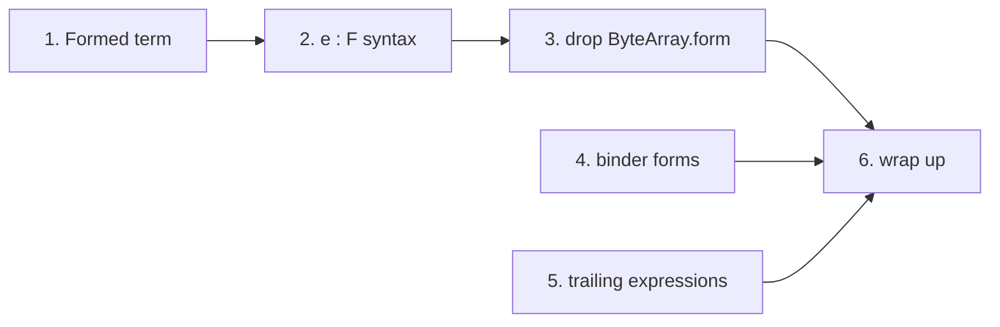

# Plan: no enforced parentheses, and `expression : expression`

Status: **in progress**. Steps 1 to 3 are done. Open questions below.

## Steps

One commit each. Details are in [Implementation steps](#implementation-steps).

- [x] 1. Add the `Formed` term, with no syntax yet (`oymomo: add Formed term`)
- [x] 2. Parse `e : F` as `Formed`, not breaking (`oymomo: parse e : F as Formed`)
- [x] 3. Remove `ByteArray.form`, breaking (`oymomo: a byte array is only bytes; its form is Formed`)
- [ ] 4. Binder forms are ordinary expressions (`oymomo: binder forms are ordinary expressions`)
- [ ] 5. Lambda, `if` and `let` as a last operand (`oymomo: lambda, if and let can be a last operand`)
- [ ] 6. Wrap up (`docs: plan_annotation implemented`)

Steps 1 to 3 must be done in order. Steps 4 and 5 can be done at any point.

## Goals

1. **Any syntax has a meaning without parentheses, based on precedence.** Parentheses
   are only ever needed to *override* precedence. No construct is illegal in an
   operand position just because it isn't parenthesized.
2. **Any term can be built dynamically from variables.** Every part of a term that is a
   term itself can come from a variable or any other expression. The motivating
   example builds a byte array's form from a variable:

```
(x -> y -> y : x) 'i1' [01]   ⇒   [01]:'i1'
```

## Decisions

1. **One new term, `Formed(term, form)`**, for `term : form`: "`term`, formed as `form`".
   It keeps oymo's word *form* for the thing after `:`. `Formed` is the whole pairing of
   an expression with its form. Other names considered: `Annotation`, `WithForm`, and
   `Form`. `Form` was rejected: it reads as if `y : x` *is* a form, and a `Form` class was
   deleted by `plan_term_as_form.md`.
2. **`ByteArray.form` is removed.** A byte array is only its bytes. `[01] : 'i8'` is
   `Formed(ByteArray([01]), 'i8')`, just like `y : 'i8'` is `Formed(y, 'i8')`. Every `:`
   that isn't on a binder is then one term with one meaning.

---

## The problems

### Problem 1: no term can hold "expression `y` with form `x`"

Only two places in the term set hold a form today:

| Term | Form field | What the form attaches to |
|---|---|---|
| `ByteArray` | `form` | `value`, which is raw `bytes`, not a term |
| `Lambda` | `param_form` | the parameter |

`ByteArray.value` is literal data. So `[01] : (x)` can be built, but `y : (x)` can't: there
is no slot where the bytes go that a variable could fill. That's why the grammar only
allows `:` after a byte array literal or a binder name.

**Solved by:** `Formed` (decision 1). The byte array's own slot goes away (decision 2).

### Problem 2: evaluation never moves a form onto a value

The closest encoding without a new term is a formed lambda parameter,
`let v : (x) = y in v`. It parses, but evaluating it loses the form:

```
(x -> y -> let v:(x) = y in v) 'i1' [01]   ⇒   [01]      (expected [01]:'i1')
```

I checked this with `banf_reduce.whnf`. `bruijn.beta` substitutes the argument and never
looks at `param_form`, and no other rule moves a form onto a value.

**Solved by:** nothing has to be moved any more. `y : x` is `Formed(y, x)`, and beta puts
`[01]` in for `y`, giving `Formed([01], 'i1')`. That's exactly what `[01] : 'i1'` parses to.
No new reduction rule is needed, and beta and evaluation order don't change.

### Problem 3: the syntax enforces parentheses (goal 1)

These are errors today only because they aren't parenthesized:

| Source | Today | Why |
|---|---|---|
| `y : x` | error | `:` only follows a binder name or a byte array |
| `x: i32 -> x` | error | a form after `:` must be a struct, byte array, group or `=>` (`FORM`/`FORM_ATOM`) |
| `x: s.f -> x` | error | same |
| `f x -> x` | error | a lambda can't be an argument |
| `f if c then a else b` | error | same for `if` |
| `f let x = a in x` | error | same for `let` |
| `a => x -> x` | error | a lambda can't be the result of `=>` |
| `fix x -> b` | error | a lambda can't follow `fix` |
| `f fix g` | error | `fix g` can't be an argument |

These already have a meaning without parentheses:

| Source | Means |
|---|---|
| `{a = x -> x}` | a lambda as a field value |
| `if c then x -> y else z` | a lambda as a branch |
| `[00]: 'i8' => 'i32'` | `[00] : ('i8' => 'i32')` |
| `x : 'i8' : 'i16' -> x` | param form `'i8' : 'i16'` (so `:` is already right-associative) |

**Solved by:** design A.

### What goal 2 does and doesn't need

| Part | From an expression today? | After this plan |
|---|---|---|
| Lambda / `let` param form (`z : x -> z`) | yes | yes |
| **Form of any expression, including a byte array from a variable** (`y : x`) | **no** (only on literals) | **yes** |
| `=>` param and result, struct field values, operands of `if`, apply, `fix`, project | yes | yes |
| Bytes of a byte array | no | no: they are literal data |
| Struct labels, project labels, binder names | no | no: they are names, not terms (open question 3) |

---

## Design

### A. Syntax

#### A1. Precedence, loosest first

| Level | Syntax | Associativity |
|---|---|---|
| expression | `x -> e`, `if … then … else e`, `let x = e in e` | extends right |
| **formed** (new) | `e : e` | right |
| apply | `f a`, `fix f` | left |
| arrow | `a => b` | right |
| project | `s.a` | left |

`:` binds looser than application and tighter than `->`/`if`/`let`, as in Haskell, OCaml
and Lean. Right associativity matches what binder forms already do.

#### A2. Trailing expressions

A lambda, `if` or `let` extends as far right as it can, so it may be the **last operand**
of any operator. It then takes the rest of the input. This is Haskell's `BlockArguments`.

| Position | Source | Means |
|---|---|---|
| last argument | `f a x -> x` | `f a (x -> x)` |
| last argument | `f if c then a else b` | `f (if c then a else b)` |
| last argument | `f let x = a in x` | `f (let x = a in x)` |
| result of `=>` | `a => x -> x` | `a => (x -> x)` |
| after `fix` | `fix x -> b` | `fix (x -> b)` |
| after `fix`, as an argument | `f fix g` | `f (fix g)` |
| right of `:` | `f y : a -> b` | `(f y) : (a -> b)` |

A trailing expression that isn't last still needs parentheses. That is precedence, not
an enforced rule: `f (x -> x) y` differs from `f x -> x y` = `f (x -> (x y))`.

#### A3. One `:` everywhere

`FORM`, `FORM_ATOM`, `rn.FORM*` and `BYTE_ARRAY`'s `FORM_OPT` go away. The form after `:`
is always a formed-level expression.

- **Lambda binder** `x : T -> b` is `Lambda.param_form`. The form ends at the first `->`,
  so it takes no trailing lambda: `x : a -> b -> c` is the lambda `x : a` with body
  `b -> c`. The parser tries the lambda first, so `x : T -> b` is a lambda whenever `x`
  is a plain name.
- **`let` binder** `let x : T = v in b` is also `Lambda.param_form`. The form ends at `=`,
  so a trailing lambda is fine.
- **Anything else**, `e : F`, is `Formed(e, F)`. This includes byte arrays: `[01] : 'i8'`.

#### What unparenthesized code means: full table

| Source | Means |
|---|---|
| `y : x` | `Formed(y, x)` |
| `[01] : 'i8'` | `Formed([01], 'i8')` |
| `f a : g b` | `(f a) : (g b)` |
| `x : A => B` | `x : (A => B)` |
| `A => B : C` | `(A => B) : C` |
| `s.a : t.b` | `(s.a) : (t.b)` |
| `fix f : T` | `(fix f) : T` |
| `a : b : c` | `a : (b : c)` |
| `x -> y : T` | `x -> (y : T)` |
| `if c then a else b : T` | `if c then a else (b : T)` |
| `let x = v : T in b` | `let x = (v : T) in b` |
| `{a = e : T}` | `{a = (e : T)}` |
| `x : T -> b` | lambda with param form `T` |
| `x : f a -> b` | lambda with param form `f a` |
| `x : a -> b -> c` | lambda `x : a` with body `b -> c` |
| `f y : a -> b` | `(f y) : (a -> b)` |
| `f [01] : 'u8' [02]` | `(f [01]) : ('u8' [02])` (changed, see breaking changes) |
| `(x -> y -> y : x) 'i1' [01]` | `(x -> (y -> (y : x))) 'i1' [01]` |

Alternative considered: `:` tighter than application (`f y : T z` = `f (y : T) z`). It
keeps today's `f [01] : 'u8' [02]`, but `y : f a` would mean `(y : f) a`. Not recommended.

### B. Terms

```python
@dataclass
class ByteArray(Term):
    value: bytes
    location: Location | None = field(default=None, compare=False)

    def children(self) -> Generator[Term, None, None]:
        yield from ()


# `term : form`: `term`, formed as `form`.
@dataclass
class Formed(Term):
    term: Term
    form: Term
    location: Location | None = field(default=None, compare=False)

    def children(self) -> Generator[Term, None, None]:
        yield self.term
        yield self.form
```

Named forms get simpler. A named form such as `i32` is the byte array `'i32'`:

```python
def name_to_form(name: str) -> ByteArray:
    return ByteArray(name.encode('ascii'))


def form_to_name(form: Term) -> str | None:
    """The name of a named form: the text of a byte array. None otherwise."""
    if isinstance(form, ByteArray):
        ...  # decode as today
    return None
```

### C. Evaluation

No new reduction rule. `Formed` itself never reduces. Two existing things learn about it:

- **C1. `whnf` reduces inside `Formed.term`.** It becomes a head position in `banf_reduce`
  (`_head` and `_with_head`), next to `Apply.function`, `Project.struct` and
  `If.condition`. So `((x -> x) [01]) : 'i1'` reduces to `[01] : 'i1'`, which is an atom.
- **C2. `if` sees through a form.** In `bruijn.reduce`, the `if` rule matches a condition
  `[01]` or `Formed([01], F)`, so `if [01]:'i1' then a else b` still reduces to `a`.

#### The example, step by step

```
(x -> y -> y : x) 'i1' [01]
→ (y -> y : 'i1') [01]          beta x
→ [01] : 'i1'                   beta y   = Formed(ByteArray([01]), 'i1') = parse("[01]:'i1'")
```

---

## Affected modules

Removing `ByteArray.form` touches 15 references in 7 files. I listed them with `grep`.

| Module | Change |
|---|---|
| `terms.py` | add `Formed`. `ByteArray` loses `form`. `name_to_form` and `form_to_name` simplify |
| `rule_names.py` | add `FORMED`, remove `FORM` and `FORM_ATOM` |
| `grammar.py` | A1–A3: the `FORMED` rule, `TRAILING` in operand positions, binder forms at formed level, `BYTE_ARRAY` without `FORM_OPT` |
| `printer.py` | `_FORMED` level. `Formed(t, f)` prints `t:f` (compact) or `t: f` (pretty), with the left side at `_APPLY` and the right side at `_FORMED`. `Formed(ByteArray, f)` prints its bytes as hex, like a formed byte array does today (`'Hi': 'i8'` → `[4869]:'i8'`). A bare `ByteArray` uses the `'text'` rule. Track trailing position for lambda/`if`/`let`. Binder forms at formed level (`x:(i32)` → `x:i32`). `_form_text`, `_form_atom_text`, `_arrow_param`, `_ends_with_form` and the `ByteArray(form=…)` cases simplify or go away |
| `bruijn.py` | in `_map_children`, the `ByteArray(form=…)` case becomes a `Formed` case. C2 in `reduce` |
| `banf_reduce.py` | C1: `Formed.term` is a head position |
| `banf_rename.py` | `other` walks into both sides of `Formed` |
| `banf_translate.py` | `atom`: `Formed(ByteArray(v), F)` → `banf.Const(v, F)`, with `_check_data_form(F)`. A bare `ByteArray` raises `Byte array: form must be known.` as today. Any other `Formed` raises a `TranslationError` |
| `banf_terms.py`, `llvm_translate.py` | none: `banf.Const` keeps its own `value` and `form` |
| `docs/notes.md` | both goals, the precedence table, trailing expressions, `Formed`, a byte array is only bytes |

Sketch of the grammar:

```python
TRAILING = First(Ref(rn.LAMBDA), Ref(rn.IF), Ref(rn.LET))

rn.EXPRESSION: First(Ref(rn.LAMBDA), Ref(rn.IF), Ref(rn.LET), Ref(rn.FORMED)),
rn.LAMBDA: Seq(NAME, Optional(':' FORMED_NO_TRAILING), '->', EXPRESSION),
rn.LET:    Seq('let', NAME, Optional(':' FORMED), '=', EXPRESSION, 'in', EXPRESSION),
rn.FORMED: First(Seq(APPLY, ':', First(TRAILING, FORMED), action=_formed), APPLY),
rn.APPLY:  First(Seq(APPLY, First(TRAILING, FIX, ARROW)), FIX, ARROW),
rn.FIX:    Seq('fix', First(TRAILING, FIX, ARROW)),
rn.ARROW:  First(Seq(PROJECT, '=>', First(TRAILING, ARROW)), PROJECT),
rn.BYTE_ARRAY: hex or ascii bytes → ByteArray(value)
```

---

## Breaking changes

> [!WARNING]
> **Syntax.** A byte array with a form in argument position now needs parentheses.
> `f [01] : 'u8' [02]` used to mean `f ([01]:'u8') [02]`. It will mean
> `(f [01]) : ('u8' [02])`. Affected tests: `grammar_test` lines 135 and 172, and
> `printer_test` round-trip cases at lines 203 and 205. The golden and `banf_translate`
> sources don't use this.

> [!WARNING]
> **Python API.** `ByteArray(value, form)` becomes `ByteArray(value)`, and `.form` on a
> byte array is gone. Affected tests:
> - `grammar_test` lines 118, 140, 145 and 260, which build or read `ByteArray.form`.
> - `test_omitted_forms_are_void` (the `[2a]` case).
> - `test_function_form_param_with_a_form_needs_parens`.
>
> The printed text doesn't change (`[01]:'i8'` prints the same), so the golden files
> should stay as they are.

> [!NOTE]
> Everything else that parses today keeps its meaning, and so does evaluation. Every
> entry in the problem 3 table gets a meaning. The tests asserting those errors change:
> `f x -> x` and `f fix` in `grammar_test`, and
> `test_form_other_than_struct_byte_array_or_function_needs_parens`. A bare `fix` with no
> operand stays an error, since that's a missing operand.

---

## Open questions

> [!IMPORTANT]
> 1. **Associativity of `:`.** I propose right (`a : (b : c)`), matching binder forms
>    today. Making a chain an error would break goal 1.
> 2. **A form on a formed byte array in BANF**, as in `([01]:'i8') : 'i16'`. It's a fine
>    term (`Formed(Formed(…))`). Should `banf_translate` reject it (proposed), or use the
>    outer form?
> 3. **Goal 2 scope.** Labels and binder names stay names. Should dynamic labels
>    (`s.(e)`, `{(e) = v}`) be a separate plan?

---

## Implementation steps

Each step is one commit and leaves `hatch run full-check` green. Each step updates
`docs/notes.md` for its own part, and its tests are listed with it.



Steps 1 to 3 are goal 2 and must be done in order. Steps 4 and 5 are goal 1. They don't
depend on 1 to 3 or on each other, so they can be done at any point.

### Step 1: add the `Formed` term, with no syntax yet

Nothing parses to `Formed` yet. Tests build it in Python.

- `terms.py`: add `Formed`.
- `bruijn.py`: a `Formed` case in `_map_children`. C2: the `if` rule sees through `Formed`.
- `banf_reduce.py`: C1, so `Formed.term` is a head position.
- `printer.py`: the `_FORMED` level between `_EXPRESSION` and `_APPLY`. `Formed(t, f)` prints
  `t:f` / `t: f`, and gets parentheses where something tighter is needed.
- `banf_translate.py`: in `atom`, `Formed(ByteArray(v, form=Void), F)` → `banf.Const(v, F)`.
  Any other `Formed` raises a `TranslationError`.
- Tests:
  - `bruijn_test`: shift and substitute reach both sides of `Formed`, and C2.
  - `banf_reduce_test`: `whnf` reduces inside `Formed`.
  - `printer_test`: printing `Formed`, compact and pretty, with parentheses.
  - `banf_translate_test`: a `Formed` byte array atom works, and other `Formed`s fail.

Commit: `oymomo: add Formed term`

### Step 2: parse `e : F` (not breaking)

- `rule_names.py` and `grammar.py`: the `FORMED` level (A1), right-associative, building
  `Formed`. `BYTE_ARRAY` keeps its `FORM_OPT` for now. So `[01] : 'i8'` is still
  `ByteArray(form=…)` and `f [01] : 'u8' [02]` keeps its meaning. **Nothing that parses
  today changes.**
- Tests:
  - `grammar_test`: the rows of the "full table" that don't involve byte arrays, added to
    `test_precedence_order`. `y : x` is `Formed(y, x)`.
  - `printer_test`: `parse(show(t)) == t` round trips for `Formed`.
  - `banf_reduce_test`: the motivating example compared by printed text:
    `show(whnf(...)) == "[01]:'i1'"`. At this step the result is `Formed(ByteArray([01]), 'i1')`,
    while `parse("[01]:'i1'")` is still `ByteArray(form='i1')`.

Commit: `oymomo: parse e : F as Formed`

### Step 3: remove `ByteArray.form` (breaking)

- `terms.py`: `ByteArray(value)`. `name_to_form` and `form_to_name` simplify.
- `grammar.py`: drop `FORM_OPT` from `BYTE_ARRAY`, so `[01] : 'i8'` goes through `FORMED`.
- `printer.py`: drop the `ByteArray(form=…)` cases. `Formed(ByteArray, f)` prints the
  bytes as hex, and a bare `ByteArray` uses the `'text'` rule.
  `_arrow_param` and `_ends_with_form` go away.
- `bruijn.py`: drop the `ByteArray(form=…)` case in `_map_children`.
- `banf_translate.py`: `atom` matches `Formed(ByteArray(v), F)`. A bare `ByteArray` keeps
  the `form must be known` error.
- Tests:
  - Update every place that builds or reads `ByteArray.form` (see breaking changes).
  - `f [01] : 'u8' [02]` now means `(f [01]) : ('u8' [02])`.
  - The motivating example now compares terms: `whnf(...) == parse("[01]:'i1'")`.
  - Golden output stays the same.

Commit: `oymomo: a byte array is only bytes; its form is Formed`

### Step 4: binder forms are ordinary expressions (goal 1)

- `grammar.py`: remove `FORM` and `FORM_ATOM`. A lambda binder form is `FORMED_NO_TRAILING`,
  so it ends at the first `->`. A `let` binder form is `FORMED`.
- `printer.py`: binder forms print at `_FORMED`, so `x:(i32) → x` becomes `x:i32 → x`.
  `_form_text` and `_form_atom_text` simplify.
- Tests:
  - `x: i32 -> x`, `x: s.f -> x` and `x : a -> b -> c` parse.
  - Update `test_form_other_than_struct_byte_array_or_function_needs_parens`.
  - Update the printer expectations that used parentheses.

Commit: `oymomo: binder forms are ordinary expressions`

### Step 5: trailing expressions (goal 1)

- `grammar.py`: `TRAILING` (lambda, `if`, `let`) as the last operand of apply, `=>`, `:`
  and `fix`. `fix` becomes an operand (A2).
- `printer.py`: track trailing position. A last-operand lambda/`if`/`let` prints without
  parentheses, and anywhere else with them.
- Tests:
  - `grammar_test`: every row of the trailing table.
  - Update the `f x -> x` and `f fix` error assertions.
  - `printer_test`: trailing and non-trailing cases, with round trips.

Commit: `oymomo: lambda, if and let can be a last operand`

### Step 6: wrap up

- Every remaining entry in the problem 3 table parses (a single test lists them all).
- Status of this plan: **implemented**.

Commit: `docs: plan_annotation implemented`

---

## Verification

After every step:

```
hatch run full-check
```

The final check is the motivating example, as a term comparison:

```python
def test_dynamic_byte_array_form():
    assert banf_reduce.whnf(bruijn.resolve(parse("(x -> y -> y : x) 'i1' [01]"))) == parse("[01]:'i1'")
```
